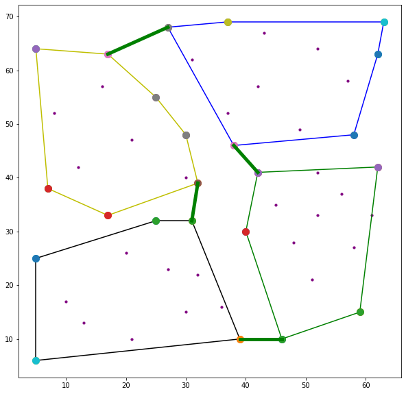
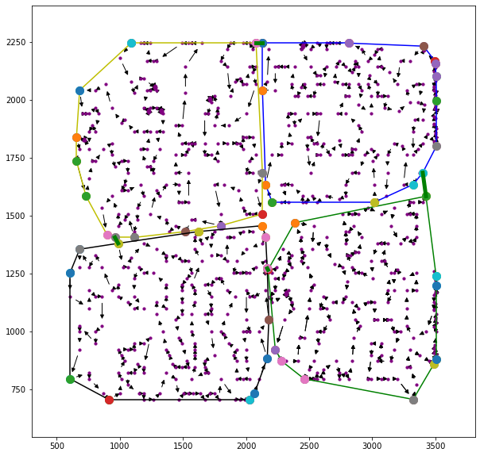

# Decomposed_Travelling_Salesman_Problem
Parallel Computing, Decentralized Optimization, TSP, Distributed Optimization
Here is a mechanism to decompose TSP to 4 subproblems so that with the growing number of the nodes, we can avoid growing solving time exponentially.
In order to decompose the original problem to subproblems, I have considered a point on the map which lies on the median of Xs and Ys of the cities to be visited. Two revolving lines centered at the lately obtained point (median) seek to partition the map to 4 subareas so that sum of the differences from the average number of the nodes is minimum. You need to consider that in a parallel strategy, solving time is sort of the maximum of solving time for each subproblem. As a result, it is essential to decompose the problem as fair as possible to avoid putting more load of work on a single agent. Since this algorithm is meant to be used for large scale problems and the problem is separated to 4 subproblems, finding the links between the sub-areas without a dynamic approach won't pose any problems. Instead, I have found the connecting arcs between areas based on the minimum distance, which performs fairly good taking into consideration that we have only 4 subproblems. Since the most important goal behind this work is reducing solving time, I have found the convex hull of each area, and comparison is done only between the pairs on the boundaries of each convex hull. This way, you will most probably find the nearest pairs without having to calculate a matrix of distances for all the nodes.
  
Finally, the algorithm here no longer seeks to find the best cycle. We are trying to optimize the hamiltonian route between the entering and exiting nodes of each area. In this regard, simulated annealing method employing 2-opt and 3-opt swap methods is used to find the best route in each area. The uploaded script contains four lines to call the sumilated annealing algorithm for each subproblem is serial. However, you can create a pool of processors and assign each one to one of the processors.
Benchmarking: The results are compared between the centralized simulated annealing and the decentralized approach. The proposed approach (Decomposed TSP) reduces solving time by about 80% compared to the original approach, while the objective value also improves with the growing size of the problems, and that's because finding the best out of smaller number of possible solutions is easier. In small-size problems, this algorithm performs as good as the centralized one in terms of objective value, but the 80% reduction in solving time is maintained.  

